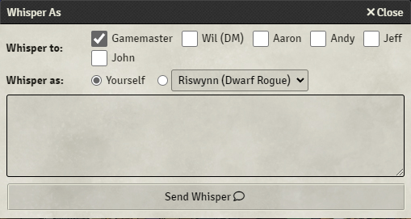

Whisper As
==

Whisper As is a [Foundry Virtual Tabletop](https://foundryvtt.com/) [add-on module](https://foundryvtt.com/article/modules/) which allows you to whisper in-character as any controlled actor, optionally with a custom alias.

## Use

Whisper As adds a new dialog, which is displayed when you type the new chat command "/whisper-as" (also "/whisperas", "/w-as", or "/was"), followed by a space.

If there is any other content in the chat window when the command is first recognized, the extra content will automatically be placed into the Whisper As dialog. This lets you add the /whisper-as command in front of content that you already typed, without needing to re-type your message in the dialog.

### Whisper to

The dialog will list the available players who can receive your whisper. You can also select "Gamemaster" to include all Gamemasters (as if you used "/w gm" in chat).

Note: if a Gamemaster's player name is "Gamemaster" that player won't be listed separately, to avoid confusion with the "all GMs" option. Any Gamemaster players with a different name can be whispered to individually.

If you're a Gamemaster, any player tokens you have selected will be pre-selected as recipients of your whisper when the dialog opens.

For both Gamemasters and players, any player tokens you have [targeted](https://foundryvtt.com/article/tokens/) will be pre-selected as recipients.

For non-Gamemaster players, if no other players are pre-selected the "Gamemaster" recipient will be pre-selected by default.

If you do not select any recipients, your message will be sent to everyone as a normal chat (i.e. not a whisper). There is an option (see below) which will warn you with a confirmation dialog before sending un-whispered messages, in case you want to be extra cautious about accidentally posting public messages that you intended to be secret.

### Whisper as

You can choose to whisper out-of-character (the Foundry default when using the standard whisper chat command), by selecting "Yourself."

You can also choose to whisper in-character (normally impossible using the standard Foundry chat commands), by selecting one of the names in the dropdown.

The in-character dropdown will include all the [actors](https://foundryvtt.com/article/actors/) for which you have Owner permission.

If there are any tokens in the active scene for which you have Owner permission, and which aren't linked to their actor (i.e. "Link Actor Data" is not checked), and which have a different name than their actor, these will also be included in the dropdown.

For example, if you add a "Bandit" actor to the current scene then change its token name to "Bandit Leader," the name "Bandit Leader" will also appear in the dropdown. If you add a few more copies of the Bandit actor, and give each token its own name, all the names will appear in the dropdown separately.

In-character names won't be duplicated in the dropdown, even if you have more than one actor or token with the same name.

For Gamemasters, the non-Gamemaster players' owned actors/tokens will be excluded from the in-character list, even if the Gamemaster has Owner permission for that token/actor. This helps avoid acidentally sending a whisper that appears to be from a different player, in case the GM has a player token selected, and forgets to check the dialog options before hitting the "send" button. If you need to send a message that appears to come from a player's character for narrative purposes, I recommend using a descriptive alias (see below), such as "\[GM] Aragorn (Mind Controlled)" to make it clear that the message isn't coming from Aragorn's usual player, to help avoid any misunderstandings.

### Alias

Whether you whisper in-character or out-of-character, you can also enter a custom alias (although if you aren't a GM this option may be disabled).

This will be shown as the name of the person who sent the whisper in the chat log. If alias is left blank the displayed name will be the name of the in-character actor you selected, or your player name if you're whispering out-of-character.

Aliases can be useful for GMs who need to send whispers from characters who aren't represented as Foundry actors/tokens, or simply to customize the description of the sender:

### Options

- **GMs Only** (GM-only world setting)
  If this option is enabled, the Whisper As dialog will only be shown for Gamemasters. The chat command will simply be ignored for non-GM players.
  If the option is not enabled, all players may use the dialog.
  This option is `false` by default, which means both GMs and players can whisper either in- or out-of-character.
- **Alias for GMs Only** (GM-only world setting)
  If this option is enabled, only Gamemasters can enter a custom alias. The dialog will not even show the option for players:
  
  If the option is not enabled, all Trusted Players may use a custom alias. There is no option to allow non-trusted Players to use aliases. The alias option can easily be abused to send whispers that appear to be from a GM or another player. Only players who can be trusted should be allowed to use this feature.
  This option is `true` by default, which means only GMs may use aliases.
- **Default to Token** (per-player client setting)
  If this option is enabled, the Whisper As dialog will default to whispering in-character when you have a token selected that you could whisper as.
  If the option is not enabled, the dialog will default to whispering out-of-character at all times.
  This option is `true` by default.
- **Active Players Only** (per-player client setting)
  If this option is enabled, the Whisper As dialog will only show players currently in the session as whisper recipients.
  If the option is not enabled, all players in the world will be shown.
  This option is `false` by default.
- **Current Scene Tokens Only** (per-player client setting)
  If this option is enabled, the Whisper As dialog will only show owned tokens currently in the active scene as in-character choices.
  If the option is not enabled, all owned tokens in the world will be shown.
  This option is `false` by default.
- **Warn If No Recipients**
  If this option is enabled, a confirmation dialog will be shown if you do not select any recipients.
  If the option is not enabled, your message will be posted as a normal chat message (i.e. not a whisper).
  This option is `false` by default, to streamline the use of the dialog for sending aliased, non-whisper messages.

## FAQ

**Q. Why a chat command? Why not a button?**

**A.** A chat command is much less likely to conflict with any other modules. A button is much more likely to cause conflicts with other modules that replace or modify the chat area (e.g. dice modules).

**Q. Is this module compatible with [Polyglot](https://github.com/mclemente/fvtt-module-polyglot)?**

**A.** Yes! Whisper As messages include type information with the messages it sends (OOC, IC, or whisper).

Polyglot uses this type information to determine the appropriate language for the message based on the speaker, and may scramble the text based on the recipient's knowledge of the selected language.

The Whisper As module doesn't attempt to determine or supply specific language information, and it doesn't provide any controls to whisper in a specific language. It only provides the type information, and lets Polyglot handle the rest. If your whisper didn't use the language you expected, or its choice to scramble the text wasn't what you wanted, please check the Polyglot documentation or source code for more information about how it makes those determinations.

**Q. My game system (or module) adds portraits, or other actor information, to the chat log. Sometimes that extra content is wrong when I whisper.**

**A.** In order to avoid duplicate names in the in-character dropdown, only one version of any given name is placed in the list. If you have multiple tokens/actors with the same name, only one will be added to the list.

For example: you might choose to whisper as "Bandit" and expect to see the portrait with a red bandana that you have in the current scene, but instead you see the one with a blue bandana that you use in some other scene. What happened here is: the dialog added the blue-bandana bandit to the dropdown list, then when it got to the red-bandana bandit, it saw that it already had a listing for the name "Bandit," so it discarded the new one as a duplicate (even though they're actually different actors with different data).

To fix this problem you just need to make sure every actor (or token in the current scene) that should appear different in chat also has a unique name. E.g. "Red Bandit" and "Blue Bandit." Then you'll get both in the dropdown. You can use aliases to remove the extra "GM-only" information that helps distinguish them, if necessary.

Another version of this problem can occur when whispering as the GM (with or without an alias). The systems and modules which decorate chat messages with additional speaker information (like portraits) do that by examining the speaker. This might result in the extra content providing information about the speaker that you didn't plan to reveal. The best advice I can offer in this case is to have a token ready in the scene to act as the speaker for any GM whisper (an invisible token, perhaps, with an anonymous portrait).

## Installation

The latest version of Whisper As can be installed most easily by searching for it in Foundry's [Add-On Modules Menu](https://foundryvtt.com/article/modules/).

You can also install it using [this link](https://github.com/WilStead/FoundryVTT.WhisperAs/releases/latest/download/module.json) ([https://github.com/WilStead/FoundryVTT.WhisperAs/releases/latest/download/module.json](https://github.com/WilStead/FoundryVTT.WhisperAs/releases/latest/download/module.json)) to install via the manifest URL.

It can also be downloaded as a zip archive [here](https://raw.githubusercontent.com/WilStead/FoundryVTT.WhisperAs/latest/whisper-as.zip) ([https://github.com/WilStead/FoundryVTT.WhisperAs/blob/latest/whisper-as.zip](https://github.com/WilStead/FoundryVTT.WhisperAs/blob/latest/whisper-as.zip)), or from the Foundry website's [module list](https://foundryvtt.com/packages/modules) for manual installation.

Please see the [official documentation](https://foundryvtt.com/article/modules/) for help installing modules via manifest URL or manually.

## Contributing

Contributions are always welcome. Please carefully read the [contributing](docs/CONTRIBUTING.md) document to learn more before submitting issues or pull requests.

## Code of conduct

Please read the [code of conduct](docs/CODE_OF_CONDUCT.md) before engaging with our community, including but not limited to submitting or replying to an issue or pull request.